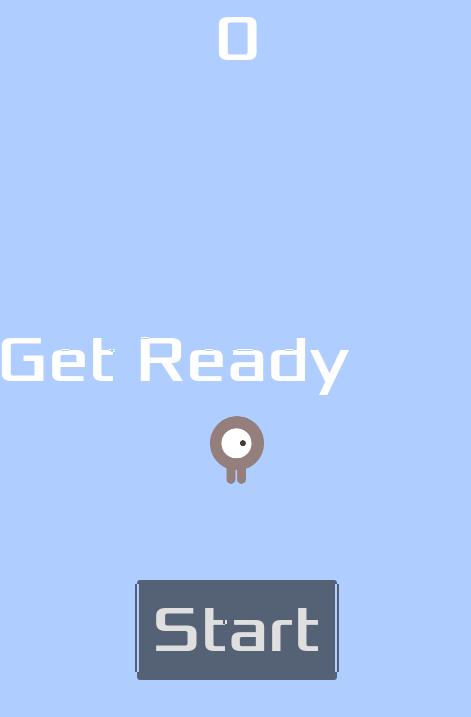
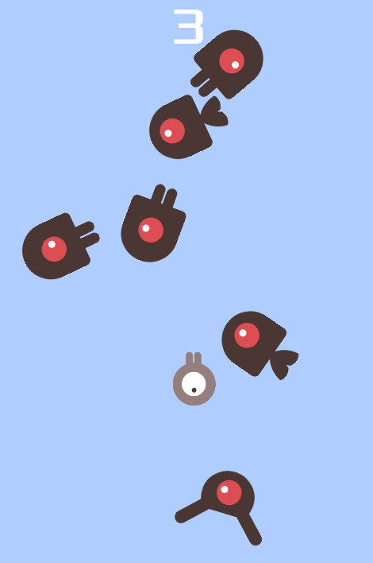

# My First Godot Game a.k.a "Dodge the Creeps" :D

My first time using a game engine for game development! Using Godot Engine, I made a simple 2D game where you play as a little sprite dodging chaotic mobs that really have it out for you. Huge thanks to the [official Godot 2D game tutorial](https://docs.godotengine.org/en/stable/getting_started/first_2d_game/index.html) for guiding me through my first game.  
Wouldn’t have made it past the first mob without it!

---
## Some Flics

  
  

  <em>This is the get ready page (left) and actual gameplay (right).</em>

---

## What I Made
- A moving player.
- Mobs that spawn randomly and move around with just a tad too much confidence.
- A score counter that counts how long you survive (before everything goes wrong).

---

## What I Learned
- How Godot scenes, timers, and signals work. Also, how much I've been missing out by stubbornly sticking to pygames rather than trying out game engines.
- That "Why won't my player move?" is a rite of passage.
- The basics of GDScript and debugging.

---

## What I Want to Add Next
- Health bars and maybe power-ups (coffee? shields?)
- Levels after things get too easy. 

---

## Why It Was Fun
- Watching mobs fly around with chaotic energy.
- Seeing code turn into a playable game was so rewarding.
- First step toward making the weird games in my head real.

---
